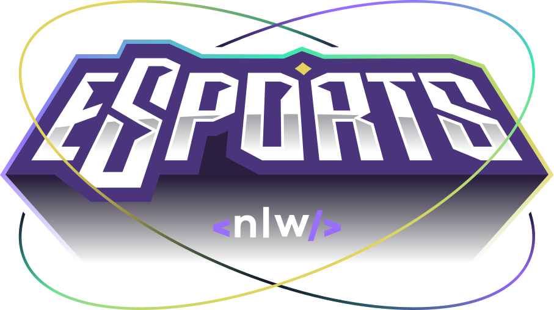

  

## Projeto simples feito durante o evento "Next Level Week" da [Rocket Seat](https://www.rocketseat.com.br/)

## 📝 Resumo
A ideia do projeto é fazer com que pessoas possam se encontrar com as outras para formar grupos em jogos.
 
Cada pessoa se inscreve preenchendo um formulário com informações relevantes para que formem "match" com as outras, não só por jogarem o mesmo jogo mas, por jogarem no mesmo horário, utilizarem Discord, dias da semana disponíveis.

***

## 🛠️ Tecnologias
- [Node.js](https://nodejs.org/en/)
- [React](https://pt-br.reactjs.org/)
- [TypeScript](https://www.typescriptlang.org/)
- [Prisma](https://www.prisma.io/)
- [TailwindCSS](https://tailwindcss.com/)

